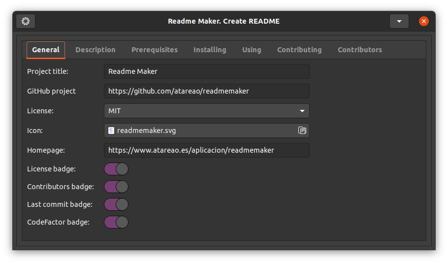
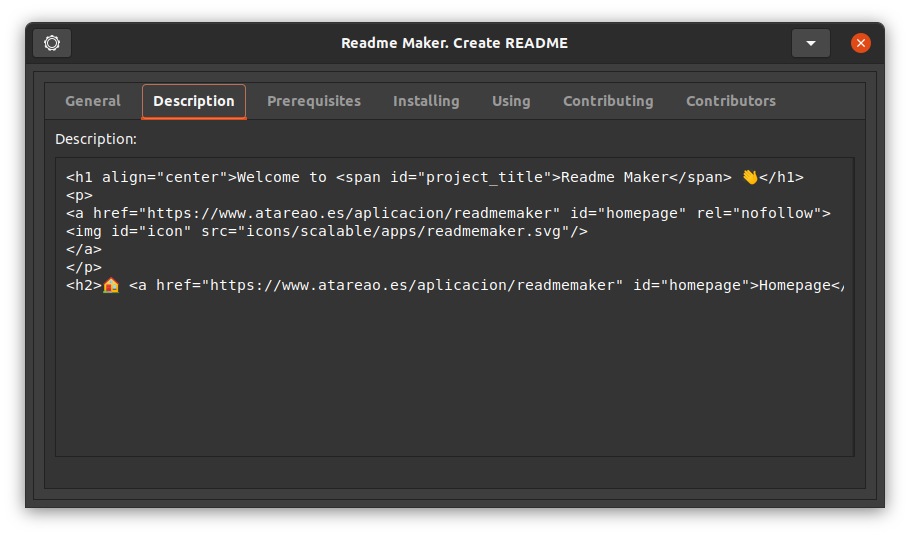
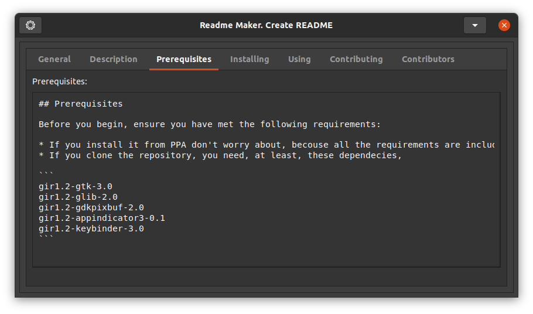
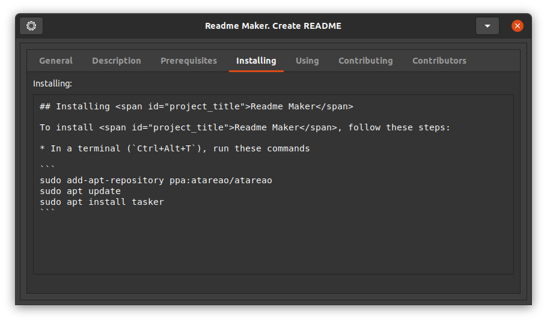
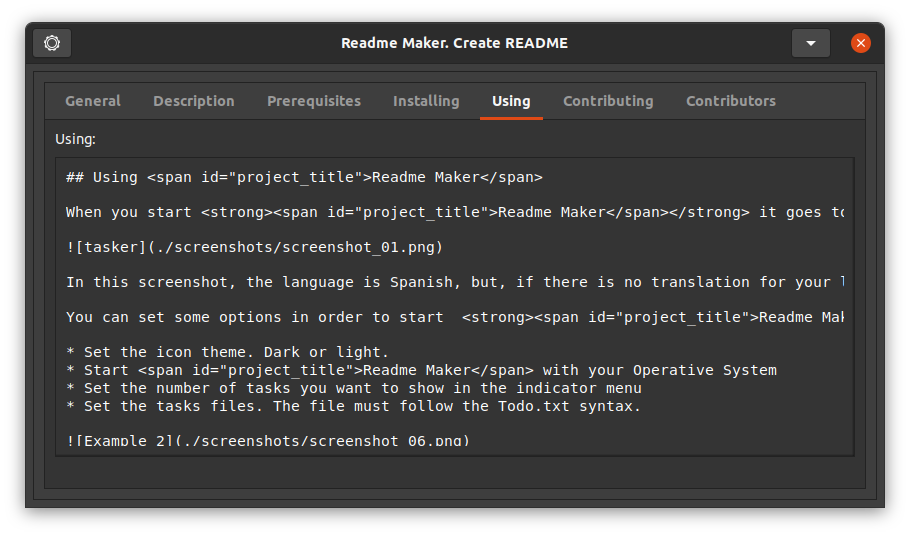
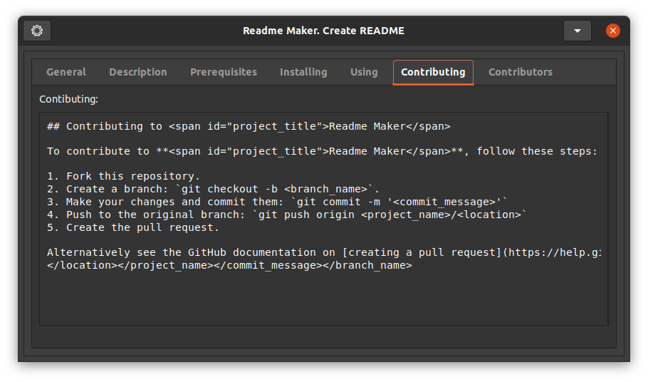
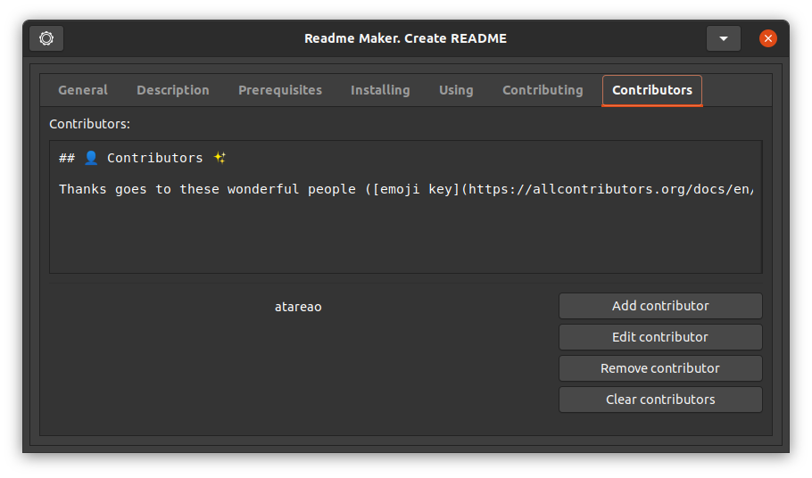
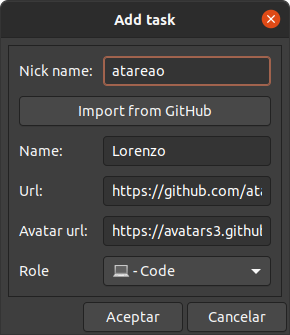

<!-- start project-info -->
<!--
project_title: Readme Maker
github_project: https://github.com/atareao/readmemaker
license: MIT
icon: /datos/Sync/Programacion/Python/readmemaker/data/icons/scalable/apps/readmemaker.svg
homepage: https://www.atareao.es/aplicacion/readmemaker
license-badge: True
contributors-badge: True
lastcommit-badge: True
codefactor-badge: True
--->

<!-- end project-info -->

<!-- start badges -->


[](https://www.codefactor.io/repository/github/atareao/readmemaker/overview/master)
<!-- end badges -->

<!-- start description -->
<h1 align="center">Welcome to <span id="project_title">Readme Maker</span> 👋</h1>
<p>
<a href="https://www.atareao.es/aplicacion/readmemaker" id="homepage" rel="nofollow">

</a>
</p>
<h2>🏠 <a href="https://www.atareao.es/aplicacion/readmemaker" id="homepage">Homepage</a></h2>
<p>Readme Maker is a simple application to help you to make your README files</p>


<!-- end description -->

<!-- start prerequisites -->
## Prerequisites

Before you begin, ensure you have met the following requirements:

* If you install it from PPA don't worry about, becouse all the requirements are included in the package
* If you clone the repository, you need, at least, these dependecies,

```
gir1.2-gtk-3.0
gir1.2-glib-2.0
gir1.2-gdkpixbuf-2.0
gir1.2-appindicator3-0.1
gir1.2-keybinder-3.0
```


<!-- end prerequisites -->

<!-- start installing -->
## Installing <span id="project_title">Readme Maker</span>

To install <span id="project_title">Readme Maker</span>, follow these steps:

* In a terminal (`Ctrl+Alt+T`), run these commands

```
sudo add-apt-repository ppa:atareao/atareao
sudo apt update
sudo apt install readmemaker
```


<!-- end installing -->

<!-- start using -->
## Using <span id="project_title">Readme Maker</span>

When you start <strong><span id="project_title">Readme Maker</span></strong> it show the folloging dialog4

In this main screen you can see 7 sections. First section is General, where you can fill the main parameters for your project. The Title of the project, the GitHub project, the license of the project, and others.



The second section is **description**, where you can introduce to the user the objective of your application. A short description.



The prerequisistes are in the third section where you must talk about the dependencies for your project.



After that, in the four section, you must tell how to install your project, so the user can enjoy with it.



Maybe, the fifth section is the most important, becouse is the place where you tell how to use your proyect.



Another important section is the sixth section, where you specify how every one can contribute to this project



Y at last a mention for everyone that contributed to this project



The information about contributors from GitHub



<!-- end using -->

<!-- start contributing -->
## Contributing to <span id="project_title">Readme Maker</span>

To contribute to **<span id="project_title">Readme Maker</span>**, follow these steps:

1. Fork this repository.
2. Create a branch: `git checkout -b <branch_name>`.
3. Make your changes and commit them: `git commit -m '<commit_message>'`
4. Push to the original branch: `git push origin atareao/readmemaker`
5. Create the pull request.

Alternatively see the GitHub documentation on [creating a pull request](https://help.github.com/en/github/collaborating-with-issues-and-pull-requests/creating-a-pull-request).
</location></project_name></commit_message></branch_name>


<!-- end contributing -->

<!-- start contributors -->
## 👤 Contributors ✨

Thanks goes to these wonderful people ([emoji key](https://allcontributors.org/docs/en/emoji-key)):


<!-- end contributors -->

<!-- start table-contributors -->

<table id="contributors">
	<tr id="info_avatar">
		<td id="atareao" align="center">
			<a href="https://github.com/atareao">
				
			</a>
		</td>
	</tr>
	<tr id="info_name">
		<td id="atareao" align="center">
			<a href="https://github.com/atareao">
				<strong>Lorenzo</strong>
			</a>
		</td>
	</tr>
	<tr id="info_commit">
		<td id="atareao" align="center">
			<a href="/commits?author=atareao">
				<span id="role">💻</span>
			</a>
		</td>
	</tr>
</table>
<!-- end table-contributors -->
